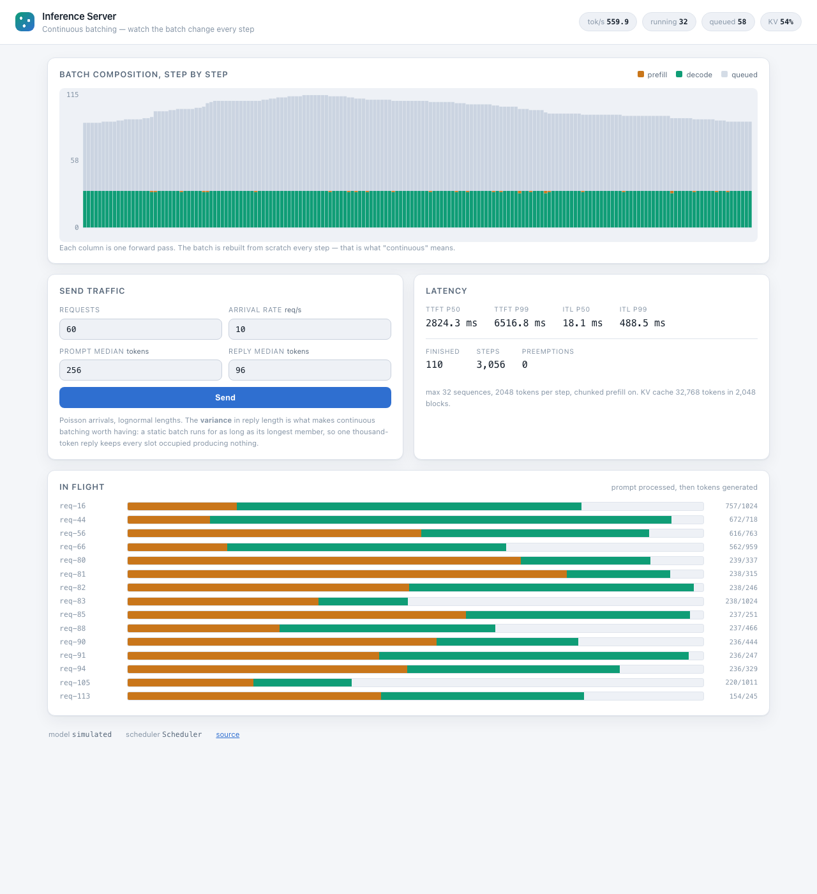

# Inference Server

[](https://github.com/Ankitnehra6/inference-server/actions/workflows/ci.yml)
[](https://www.python.org/)
[](LICENSE)

An LLM inference server built around a **continuous-batching scheduler** — the part of a serving
stack that decides whether a GPU does 200 tokens a second or 2000.

The model is interchangeable and deliberately not the point. The scheduler is: batching policy,
paged KV cache accounting, preemption under memory pressure, chunked prefill, and cancellation.



*Each column is one forward pass. Green is decode, orange is prefill, grey above the line is the
queue. The batch stays full because it is rebuilt from scratch every step — that is what
"continuous" means.*

---

## The numbers

400 requests at 8/s. Prompts p50 234 tokens, replies p50 121 with a heavy tail. Simulated
7B-class model on a virtual clock, so results are exact and reproducible from the seed.
Reproduce with `make bench`.

### Scheduling policy

| scheduler | output tok/s | req/s | TTFT p50 | TTFT p99 | ITL p50 | mean batch |
|---|---:|---:|---:|---:|---:|---:|
| sequential | 78.6 | 0.40 | 486 s | 936 s | 12.2 ms | 1.0 |
| static batching | 539.5 | 2.76 | 39 s | 82 s | 16.1 ms | 10.6 |
| **continuous** | **981.9** | **5.03** | **4.2 s** | **16 s** | 21.6 ms | **40.7** |

Two gaps, answering different questions:

- **Sequential → static: 6.9×.** That is what batching alone buys.
- **Static → continuous: 1.8× throughput and 5× lower p99 TTFT.** That is what the *scheduling
  policy* buys, and it is what this project is about.

**The mechanism is the mean batch size: 40.7 against 10.6.** Continuous batching does not run
faster, it runs *fuller*. A static batch runs for as long as its longest member, so one
thousand-token reply keeps every slot occupied producing nothing.

### Memory pressure

Same traffic, shrinking KV cache:

| cache tokens | output tok/s | preemptions | mean batch |
|---:|---:|---:|---:|
| 131,072 | 981.9 | 0 | 40.7 |
| 32,768 | 913.9 | 42 | 40.3 |
| 8,192 | 523.6 | 240 | 14.5 |
| 4,096 | 368.2 | 250 | 7.2 |

**32× less memory costs 2.7× throughput** — and every request still completes with exactly the
tokens it asked for. Preemption costs work, never correctness.

### Chunked prefill

Long prompts (p50 768 tokens) at 8 req/s:

| | output tok/s | p99 TTFT | p99 ITL | mean batch |
|---|---:|---:|---:|---:|
| chunked | **510.3** | **89 s** | 718 ms | 41.3 |
| not chunked | 230.8 | 281 s | 659 ms | 4.5 |

2.2× the throughput and 3.2× lower p99 TTFT — **but inter-token latency is unchanged, which
contradicts the usual claim for chunked prefill.** It does not need to protect ITL here, because
decodes are scheduled before prefills, so a long prompt can never take a step away from a reply
in flight. What chunking actually buys is admission: without it a long prompt waits for a step
with room for all of it, and the batch starves at 4.5. Reporting this as an ITL win because that
is what the literature emphasises would have been the easy mistake; the numbers say otherwise.

---

## Try it

```bash
git clone https://github.com/Ankitnehra6/inference-server.git
cd inference-server

make serve   # live view on http://localhost:8000
make bench   # every table above, in a few seconds
make test    # 41 tests
```

In the live view, press **Send** and watch the batch fill. Raise the arrival rate past what the
server can sustain and watch the grey backlog grow while the green batch stays pinned at its
limit — that is a saturated server behaving correctly rather than falling over.

```bash
curl -N localhost:8000/v1/completions \
  -H 'Content-Type: application/json' \
  -d '{"prompt_tokens": 512, "max_tokens": 64, "stream": true}'
```

---

## How the scheduler works

Each step builds a batch under two budgets — sequences and tokens — in a deliberate order:

```
1. decodes first        one token each; this is what a user sees as the reply streaming
2. prefills after       whatever budget is left, chunked if the prompt does not fit
3. preempt if needed    a running request that cannot grow evicts another
```

Decode-first is not an implementation detail. Letting prefill crowd out decode produces a server
with excellent throughput and visibly stuttering output.

### The invariant everything follows from

A request is in exactly one of two places, decided by **memory**, not progress:

- `waiting` — holds no cache blocks. Never run, or preempted and stripped.
- `running` — holds cache blocks. May be mid-prompt or generating; either way it occupies memory
  something else could use.

Defining `running` as "holds memory" rather than "is generating" is what makes preemption
correct. A half-prefilled request occupies just as much cache as a decoding one, so it must be
evictable on the same terms — **a scheduler that only evicts decoding requests can fill its cache
with half-finished prefills and deadlock, with nothing to evict and nothing able to proceed.**
That was a real bug during development, not a hypothetical.

### Paged KV cache

Each token the model sees leaves a key and value that live as long as the request. Cache memory,
not compute, is what limits concurrency.

The naive approach reserves one contiguous region per request, sized for its worst case: a
request that *might* generate 2048 tokens reserves 2048, and if it stops after 20 the rest is
wasted for its whole lifetime. Worse, contiguous reservations fragment — plenty free in total, no
single run big enough.

So the cache is split into 16-token blocks and each request gets a *block table* of block numbers
that need not be adjacent. Waste drops to at most 15 tokens per request, fragmentation disappears
entirely, and out-of-memory becomes **recoverable** — a block table can be torn up and rebuilt
elsewhere, which is exactly what preemption needs.

### Preemption

When a running request needs a block and none is free, a victim's cache is reclaimed and it goes
back to the queue to run its prompt again. Three choices, each with a reason:

- **Recompute, not swap.** No second memory pool, no transfer path, and for the short sequences
  that actually get preempted, cheaper than two bus traversals. vLLM implements both; this
  implements one and says which.
- **Evict the newest.** Least progress, cheapest to redo. Evicting the oldest can livelock — a
  long request thrown out just before finishing, redoing its prefill forever.
- **Requeue at the front.** At the back, new arrivals overtake it repeatedly and it may never
  finish.

---

## Tests

**41 tests**, none of which need a model or an accelerator — the scheduler was kept free of
tensors precisely so every decision could be checked exactly.

| Test | What it pins down |
|---|---|
| `test_a_finished_request_is_replaced_on_the_very_next_step` | The definition of continuous batching. If it fails, this is a static batcher wearing a different name |
| `test_static_batching_makes_a_short_request_wait_for_a_long_one` | The behaviour being fixed, asserted on the baseline |
| `test_preempts_when_the_cache_runs_out_and_still_finishes_everything` | A cache far too small forces repeated eviction; every request still produces exactly the tokens it asked for |
| `test_blocks_need_not_be_contiguous` | Frees three scattered blocks and allocates three — a contiguous allocator fails here. That is fragmentation |
| `test_batching_is_nearly_free_which_is_the_reason_any_of_this_exists` | The premise: 32 sequences must cost far less than 2× one. If this were false, none of this would be worth building |
| `test_continuous_batching_beats_static_on_realistic_traffic` | The headline claim as a test, so a regression fails the build |
| `test_a_bigger_batch_is_what_makes_the_difference` | Pins the *mechanism*, so a throughput win for some other reason cannot silently invalidate the README's explanation |

---

## Bugs this found

- **A deadlock from defining "running" as "generating".** Preemption only considered decoding
  requests, so the cache could fill entirely with half-finished prefills that nothing was allowed
  to evict, and the scheduler would sit forever with work outstanding and no way to proceed.
  Fixed by making the split memory-based: anything holding blocks is evictable.
- **A strawman baseline that would have flattered the result.** The first static batcher sealed
  its batch after one prefill step, capping it at whatever fitted in a single token budget —
  about eight requests. That made continuous batching look 5× better. A fair static batcher
  admits its whole batch in one decision, and the honest number is 1.8×.
- **A conclusion that contradicted its own data.** The chunked-prefill section asserted it "cuts
  p99 inter-token latency" while printing 718 ms against 659 ms — the opposite. The real finding
  is that decode-first ordering already protects ITL, and chunking is a throughput and TTFT win.

---

## What is not built

- **No real model.** This schedules; it does not compute. `SimulatedEngine` reports modelled
  step times from an explicit cost model, and every number in this README comes from it. The
  `ModelEngine` interface is two methods wide precisely so a real engine can be dropped in, and
  none is — so the plumbing between a scheduler and an actual forward pass is untested here.
  [ADR 2](docs/adr/0002-a-simulated-model.md) argues that a real model is the wrong instrument
  for measuring a *scheduler*, which it is; it is not an argument that the integration would be
  free.
- **No PagedAttention kernel.** The block *accounting* is real; the attention op that would read
  a block table is not, because it would need CUDA.
- **No prefix caching.** Two requests sharing a system prompt each prefill it in full. Sharing
  the blocks is a large, well-understood win and is not here.
- **No speculative decoding, no quantization, no tensor parallelism.**
- **Single process.** No sharding across replicas.
- **FCFS only.** No priorities, no fairness beyond arrival order, and the queue deliberately
  head-of-line blocks rather than letting later requests overtake — which bounds waiting time at
  the cost of throughput, and is tested as a decision rather than discovered as a bug.

---

## Design decisions

1. [Continuous batching, and why static batching is not enough](docs/adr/0001-continuous-batching.md)
2. [Benchmark the scheduler against a simulated model, not a real one](docs/adr/0002-a-simulated-model.md)
3. [A paged KV cache, and preemption by recompute](docs/adr/0003-paged-kv-cache.md)
4. [Decode-first scheduling, with chunked prefill](docs/adr/0004-chunked-prefill.md)

## Reference

Kwon et al., *Efficient Memory Management for Large Language Model Serving with PagedAttention*
(2023), [arXiv:2309.06180](https://arxiv.org/abs/2309.06180) — the vLLM paper.
Yu et al., *Orca: A Distributed Serving System for Transformer-Based Generative Models* (OSDI
2022) — where continuous batching was introduced.

## License

MIT — see [LICENSE](LICENSE).
